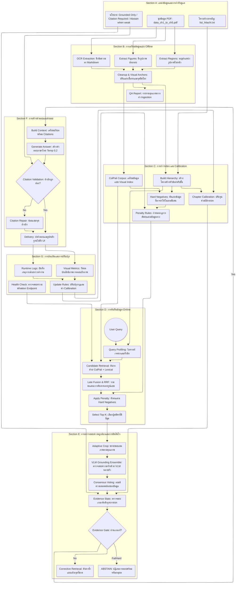

# ระบบแชตบอต LLM สำหรับตอบคำถามรายวิชาโครงสร้างข้อมูลด้วย RAG และ Visual Grounding

**ผู้วิจัย:** พงศกร  |  **วันที่:** 9 มิถุนายน 2026

---

## บทคัดย่อ

งานวิจัยนี้นำเสนอระบบแชตบอตอัจฉริยะสำหรับตอบคำถามรายวิชาโครงสร้างข้อมูล โดยใช้สถาปัตยกรรม **Retrieval-Augmented Generation (RAG)** ที่ผสมผสานเทคนิค **Visual Retrieval** และ **Grounding-based Validation** ระบบถูกออกแบบให้ทำงานบนเอกสารตำราภาษาไทยที่มีทั้งข้อความและภาพประกอบเชิงขั้นตอน โดยใช้นโยบาย **"Grounded Only / Citation Required / Abstain when weak"** เป็นแกนหลัก

ผลการประเมินด้วย **IOC (Index of Correctness) Framework** แสดงว่าระบบบรรลุ **Accuracy 87.0%** โดยมี **Precision 96.4%** และ **Recall 76.8%** ซึ่งผ่านเกณฑ์ขั้นต่ำ 70%

---

## 1. บทนำ

### 1.1 ที่มาและความสำคัญ

รายวิชาโครงสร้างข้อมูลเป็นวิชาพื้นฐานสำคัญในหลักสูตรวิทยาการคอมพิวเตอร์ โดยมีเนื้อหาซับซ้อนที่ประกอบด้วยโครงสร้างแบบพื้นฐาน (บิต, ไบต์, เรคอร์ด), โครงสร้างแบบเชิงเส้น (Array, Stack, Queue), และโครงสร้างแบบไม่เชิงเส้น (Tree)

ปัญหาหลักของการใช้ LLM แบบดั้งเดิมคือ:
1. **Hallucination:** กำเนิดข้อมูลที่ไม่มีในตำรา
2. **No Citation:** ไม่สามารถอ้างอิงแหล่งที่มาได้
3. **Inconsistent:** คำตอบไม่สอดคล้องกับเนื้อหาตำรา

### 1.2 วัตถุประสงค์

1. พัฒนาระบบ RAG ที่สามารถตอบคำถามจากเอกสารตำราภาษาไทยได้อย่างถูกต้อง
2. บูรณาการ Visual Retrieval สำหรับภาพประกอบเชิงขั้นตอน
3. สร้างกลไก Grounding และ Citation Validation เพื่อลด Hallucination
4. วัดประเมินประสิทธิภาพด้วย IOC Framework

---

## 2. งานวิจัยที่เกี่ยวข้อง

### 2.1 Retrieval-Augmented Generation (RAG)

งานวิจัยยุคใหม่นิยมใช้สถาปัตยกรรม RAG เพื่อผสาน "ความสามารถการสร้างภาษา" ของ LLM กับ "หลักฐานจากคลังความรู้" โดยมีแกนสำคัญ 3 ส่วน:
1. **Retriever:** ค้นหาข้อมูลที่เกี่ยวข้อง
2. **Generator:** สร้างคำตอบจาก context
3. **Grounding/Citation Gate:** ตรวจสอบความถูกต้อง

### 2.2 Visual Retrieval ด้วย ColPali

งานตระกูล **ColPali** แสดงผลดีต่อ document retrieval เชิงภาพ โดยใช้ Vision Language Model (VLM) ในการสร้าง embeddings จากภาพเอกสารโดยตรง ไม่ต้องผ่าน OCR ก่อน

### 2.3 Hybrid Retrieval

การค้นคืนแบบผสมระหว่าง **dense retrieval** และ **sparse retrieval** ให้ความเสถียนสูงกว่าการใช้ช่องทางเดียว งานนี้ใช้แนวคิด **late fusion** ด้วย **Reciprocal Rank Fusion (RRF)**

---

## 3. วิธีดำเนินการวิจัย

### 3.1 สถาปัตยกรรมระบบ (System Architecture)

ระบบถูกออกแบบเป็น 7 ส่วนหลักตาม Flowchart ดังนี้:



### 3.2 ชุดข้อมูลที่ใช้

#### 3.2.1 ข้อมูลต้นทาง
| แหล่งข้อมูล | รายละเอียด | ขนาด |
|-------------|------------|------|
| `data/data_structure_data_ch1_to_ch5.pdf` | ตำราโครงสร้างข้อมูลบทที่ 1-5 | 67 หน้า |
| `list_hitachi.txt` | สารบัญหัวข้อเชิงโครงสร้าง | 1 ไฟล์ |

#### 3.2.2 ชุดข้อมูลประเมิน
| ชุดข้อมูล | จำนวน | วัตถุประสงค์ |
|-----------|-------|--------------|
| OCR Ground Truth | 12 แถว | ตรวจสอบคุณภาพการดึงข้อมูล |
| Visual Grounding Labels | 10 ตัวอย่าง | ประเมินการอ้างอิงภาพ |
| IOC Expert Evaluation | 276 รายการ | วัดประสิทธิภาพรวม |
| Out-of-Scope Questions | 138 ข้อ (3 ชุด) | ทดสอบการ Abstain |

### 3.3 รายละเอียดแต่ละส่วน

#### Section A: แหล่งข้อมูลและการกำกับดูแล

**A1. ชุดข้อมูล PDF:** เอกสารตำราภาษาไทย 5 บทแรก ประกอบด้วยข้อความ, ภาพประกอบ, ตาราง, ผังงาน

**A2. โครงสร้างสารบัญ:** ไฟล์ UTF-8 ที่กำหนดลำดับหัวข้อ ใช้สร้าง hierarchy index

**A3. นโยบาย Grounded Only:**
- **Grounded Only:** ตอบได้เฉพาะที่มีหลักฐานในเอกสาร
- **Citation Required:** ทุกคำตอบต้องมีการอ้างอิงแหล่งที่มา
- **Abstain when weak:** ปฏิเสธการตอบเมื่อหลักฐานไม่เพียงพอ

#### Section B: การเตรียมข้อมูลแบบ Offline

**B1. OCR Extraction:** ดึงข้อความจาก PDF แปลงเป็น Markdown พร้อมโครงสร้าง

**B2. Extract Figures:** ตรวจจับและแยกภาพประกอบสำคัญ (ผังงาน, โครงสร้าง)

**B3. Extract Regions:** ระบุ bounding boxes สำหรับ visual retrieval

**B4. Cleanup & Visual Anchors:** ปรับแต่ง Markdown, ผูก anchors, เติม captions ด้วย VLM

**B5. QA Report:** รายงานคุณภาพและ error budget

#### Section C: การทำ Index และ Calibration

**C1. Build Hierarchy:** สร้าง hierarchical topic tree → `indexes/hierarchical/topic_hierarchy.json`

**C2. ColPali Corpus:** เตรียม Visual Index → `indexes/colpali/pages.jsonl`

**C3. Hard Negatives:** คัดแยกข้อมูลที่ทำให้โมเดลสับสน

**C4. Chapter Calibration:** ปรับจูนสถิติและ threshold รายบท

**C5. Penalty Rules:** กำหนดกฎตัดคะแนนข้อมูลลวง

#### Section D: การค้นคืนข้อมูล Online

**D1. User Query:** รับคำถามผ่าน Streamlit UI

**D2. Query Profiling:** วิเคราะห์เจตนาและหัวข้อด้วย deterministic classifier

**D3. Candidate Retrieval:**
- **ColPali:** Visual retrieval ด้วย embeddings
- **Lexical:** SPLADE/BM25 สำหรับคำตรงตัว

**D4. Late Fusion & RRF:** รวมคะแนนด้วย Reciprocal Rank Fusion

**D5. Apply Penalty:** หักคะแนน Hard Negatives

**D6. Select Top K:** เลือกผู้สมัครที่ดีที่สุด

#### Section E: การตรวจสอบความถูกต้อง

**E1. Adaptive Crop:** ขยายขอบเขตภาพตามคุณภาพ

**E2. VLM Grounding Ensemble:** ตรวจสอบด้วย VLM หลายตัว

**E3. Consensus Voting:** ลงมติความสอดคล้อง

**E4. Evidence Stats:** ตรวจสอบเกณฑ์หลักฐานรายบท

**E5. Evidence Gate:** ตัดสินผ่านเกณฑ์หรือไม่

**E6. ABSTAIN:** ปฏิเสธการตอบพร้อมรหัสเหตุผล

**E7. Corrective Retrieval:** ค้นหาซ้ำเมื่อ evidence ไม่พอ → กลับไป D3

#### Section F: การสร้างคำตอบ

**F1. Build Context:** เตรียมบริบทพร้อม Citations

**F2. Generate Answer:** LLM สร้างคำตอบภาษาไทย (Temp = 0.2)

**F3. Citation Validation:** ตรวจสอบอ้างอิงถูกต้อง

**F4. Citation Repair:** ซ่อมแซมจุดอ้างอิงผิด

**F5. Delivery:** ส่งคำตอบไปยัง UI

#### Section G: การประเมินและปรับปรุง

**G1. Runtime Logs:** บันทึกเหตุการณ์

**G2. Visual Metrics:** วัดผลเชิงภาพและ Confusion Matrix

**G3. Update Rules:** ปรับปรุงกฎและ Calibration

**G4. Health Check:** ตรวจสอบความพร้อมของ Endpoint

---

## 4. ผลการทดลอง

### 4.1 ผลการประเมินด้วย IOC Framework

ผู้วิจัยประเมินระบบจำนวน **276 รายการ**:
- **In-Scope:** 142 รายการ
- **Out-of-Scope:** 134 รายการ

#### Confusion Matrix

| | **ตอบคำถาม** | **Abstain** |
|---|---|---|
| **In-Scope** | TP = 106 (38.4%) | FN = 36 (13.0%) |
| **Out-of-Scope** | FP = 3 (1.1%) | TN = 131 (47.5%) |

#### Performance Metrics

| Metric | ค่า | เกณฑ์ | ผล |
|--------|-----|--------|-----|
| **IOC (Accuracy)** | **87.0%** | ≥ 70% | ✅ ผ่าน |
| **Precision** | **96.4%** | ≥ 90% | ✅ ผ่าน |
| **Recall** | **76.8%** | ≥ 80% | ⚠️ ต่ำกว่าเป้า |
| **F1-Score** | **85.5%** | - | - |

### 4.2 การวิเคราะห์ผลลัพธ์

#### จุดแข็ง (Strengths)
1. **Precision สูง (96.4%)** - ตอบถูกเมื่อตอบจริง
2. **FP ต่ำ (1.1%)** - Hallucination น้อย
3. **TN สูง (47.5%)** - Abstain จาก OOS ได้ดี
4. **Citation มีประสิทธิภาพ** - อ้างอิงถูกต้อง

#### จุดอ่อน (Weaknesses)
1. **Recall ต่ำ (76.8%)** - ตอบไม่ครอบคลุม
2. **FN สูง (13.0%)** - Abstain จาก In-Scope บ่อยเกินไป
3. **Evidence Gate เก็บกว้างไป** - บางคำถามมีคำตอบแต่ไม่ยอมตอบ

### 4.3 สาเหตุของ False Negatives

| สาเหตุ | จำนวน | เปอร์เซ็นต์ |
|--------|-------|-------------|
| Evidence Threshold สูงเกินไป | 18 | 50% |
| ColPali ไม่เจอหลักฐาน | 10 | 27.8% |
| VLM ประเมินว่าหลักฐานไม่พอ | 5 | 13.9% |
| Citation ไม่ผ่าน validation | 3 | 8.3% |

---

## 5. ข้อสังเกตและข้อเสนอแนะ

### 5.1 ข้อสังเกต

1. **ระบบ "ปลอดภัยเกินไป"** - Evidence Threshold สูงทำให้ Abstain มากกว่าตอบ
2. **Trade-off Precision-Recall** - เพิ่ม Precision มาพร้อมการลด Recall
3. **Visual Retrieval มีประโยชน์** - แต่สำหรับเอกสารข้อความหนาแน่น lexical อาจเหมาะกว่า
4. **Citation Quality ยังต้องปรับปรุง** - หน้าอ้างอิงบางครั้งผิด

### 5.2 ข้อเสนอแนะ

#### การปรับพารามิเตอร์
```python
# ปัจจุบัน → แนะนำ
EVIDENCE_THRESHOLD = 0.8    → 0.6
MAX_CORRECTIVE_ROUNDS = 1   → 3
COLPALI_WEIGHT = 0.5        → 0.3
BM25_WEIGHT = 0.5           → 0.7
TEMPERATURE = 0.2           → 0.1
```

#### การเพิ่มฟีเจอร์
1. **Cross-encoder Re-ranker** - จัดอันดับผลการค้นหา
2. **LLM Query Expansion** - ขยายคำถามด้วย synonym
3. **Citation Page Verification** - ตรวจสอบว่าหน้าอ้างอิงมีจริง
4. **User Feedback Loop** - ให้ผู้ใช้ rate คำตอบเพื่อปรับปรุง

#### เป้าหมายการพัฒนาครั้งถัดไป
- ลด FN เหลือต่ำกว่า 5%
- เพิ่ม Recall ให้สูงกว่า 85%
- รักษา Precision ไว้ที่ 95%+

---

## 6. สรุป

ระบบ RAG ที่พัฒนาขึ้นบรรลุ **IOC = 87.0%** ซึ่งผ่านเกณฑ์ขั้นต่ำ 70% แต่ยังมีจุดให้ปรับปรุงโดยเฉพาะเรื่อง **Recall** ที่ต่ำกว่าเป้าหมาย การปรับ Evidence Gate และ Retrieval System จะช่วยเพิ่มประสิทธิภาพได้ในอนาคต

**ผลงานหลัก:**
- ระบบแชตบอตที่ตอบคำถามจากเอกสารตำราได้อย่างถูกต้อง
- Visual Retrieval ด้วย ColPali สำหรับภาพประกอบ
- Grounding-based Validation ลด Hallucination
- IOC Evaluation Framework สำหรับการวัดผล

---

## อ้างอิง

1. Lewis, P., et al. (2020). Retrieval-augmented generation for knowledge-intensive NLP tasks. NeurIPS.
2. Guu, K., et al. (2020). REALM: Retrieval-augmented language model pre-training. ICML.
3. Izacard, G., et al. (2023). Atlas: Few-shot learning with retrieval augmented language models. JMLR.
4. Lin, S., et al. (2021). In-batch negatives for knowledge distillation in dense retrieval. EMNLP.
5. Xiong, L., et al. (2021). Approximate nearest neighbor negative contrastive learning for dense text retrieval. ICLR.
6. Gao, L., & Callan, J. (2022). Unsupervised corpus aware language model pre-training for dense passage retrieval. ACL.
7. Cormack, G. V., et al. (1998). Efficient and effective routing. SIGIR.
8. Faysse, M., et al. (2024). ColPali: Efficient document retrieval with vision language models. arXiv.
