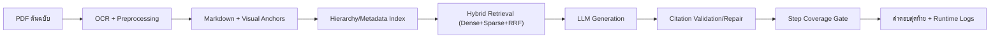

# รายงานวิจัย (บทที่ 2–5)  
**หัวข้อ:** ระบบแชตบอต LLM สำหรับตอบคำถามรายวิชาโครงสร้างข้อมูลด้วย Retrieval-Augmented Generation (RAG) และ Visual Grounding

---

## บทที่ 2 เอกสารและงานวิจัยที่เกี่ยวข้อง

### 2.1 แนวคิดระบบ LLM Chatbot แบบ RAG
งานวิจัยยุคใหม่ด้านแชตบอตเชิงวิชาการนิยมใช้สถาปัตยกรรม Retrieval-Augmented Generation (RAG) เพื่อผสาน “ความสามารถการสร้างภาษา” ของ LLM กับ “หลักฐานจากคลังความรู้” ที่ค้นคืนแบบเฉพาะเจาะจง [1], [2], [3] โดยมีแกนสำคัญ 3 ส่วน คือ  
1. โมดูลค้นคืนข้อมูล (Retriever)  
2. โมดูลสร้างคำตอบ (Generator)  
3. โมดูลควบคุมความน่าเชื่อถือ (Grounding/Citation Gate)  

สำหรับงานนี้ โจทย์เป็นเอกสารสแกนภาษาไทยที่มีทั้งข้อความและภาพประกอบเชิงขั้นตอน จึงต้องเสริมแนวคิด RAG แบบทั่วไปด้วยการค้นคืนเชิงภาพ (Visual Retrieval) และการบังคับอ้างอิงแหล่งที่มาในทุกข้อความสำคัญ

### 2.2 งานวิจัยด้านการแปลงเอกสารสแกนเป็นข้อมูลเชิงโครงสร้าง
ปัญหาเอกสารสแกนไม่ใช่เพียง OCR ตัวอักษร แต่รวมถึงการคงโครงสร้างหัวข้อ ภาพ ตาราง และบริบทการอธิบายขั้นตอน [9], [10], [11] งานวิเคราะห์โครงหน้าเอกสาร (layout analysis) ระบุว่าคุณภาพ downstream retrieval จะลดลงทันทีเมื่อหัวข้อหรือคำบรรยายภาพสูญหาย [11]  

ดังนั้นงานวิจัยนี้ออกแบบ preprocessing แบบหลายชั้น:  
1. OCR + โครงสร้างหัวข้อ  
2. ตรวจจับ region ภาพประกอบ  
3. ผูก visual anchor ลงใน markdown  
4. เติมคำบรรยายภาพเชิงหลักฐาน (caption enrichment)  

### 2.3 งานวิจัยด้าน Retrieval แบบผสม (Hybrid Retrieval)
การค้นคืนแบบผสมระหว่าง dense retrieval และ sparse retrieval ให้ความเสถียรสูงกว่าการใช้ช่องทางเดียว โดยเฉพาะกับคำถามที่มีทั้งคำเฉพาะและความหมายแฝง [4], [5], [6], [7]  
ในงานนี้ใช้แนวคิด late fusion ด้วย Reciprocal Rank Fusion (RRF) เพื่อรวมคะแนนจาก dense และ sparse ก่อนเข้าสู่ขั้น reranking

### 2.4 งานวิจัยด้าน Visual Retrieval และ Grounding
เอกสารลักษณะตำราโครงสร้างข้อมูลมีภาพลำดับขั้น (queue/stack/tree traversal) จำนวนมาก การค้นคืนด้วยข้อความล้วนมีโอกาสพลาดหลักฐานจากรูป งานตระกูล ColPali แสดงผลดีต่อ document retrieval เชิงภาพ [8] จึงถูกใช้เป็นช่องทาง visual retrieval หลักในระบบนี้  

ในด้านความน่าเชื่อถือ การประเมินแบบ grounding และการบังคับ citation มีผลลด hallucination อย่างมีนัยสำคัญ [12], [13], [14]

### 2.5 กรอบแนวคิดวิจัยของงานนี้
งานนี้ตั้งสมมติฐานว่า “หากปรับปรุง preprocessing เชิงโครงสร้าง + ใช้ hybrid retrieval + บังคับ citation/step-coverage gate จะเพิ่มความถูกต้องทั้งเชิง routing และเชิงเนื้อหา”

กรอบแนวคิดประกอบด้วย:
1. Data pipeline: PDF สแกน -> markdown เชิงโครงสร้าง + visual anchors  
2. Retrieval pipeline: Dense + Sparse + RRF + Reranker + Metadata filtering  
3. Answer pipeline: LLM generation -> citation validation -> repair -> step coverage gate  
4. Evaluation pipeline: OCR quality + retrieval benchmark + routing regression + expert review

---

## บทที่ 3 วิธีดำเนินการวิจัย

### 3.1 ภาพรวมการออกแบบระบบ
ระบบถูกพัฒนาในรูปแบบ end-to-end pipeline โดยใช้ไฟล์ต้นฉบับตำรา `data/data_structure_data_ch1_to_ch5.pdf` และแปลงเป็นคลังความรู้พร้อมใช้งานกับ LLM chatbot

ลำดับการทำงานหลักของแชตบอตใน runtime:
1. `chat_turn_started` เมื่อรับคำถามผู้ใช้  
2. จัดหัวข้อด้วย deterministic topic classifier (`topic_classified_deterministic`) และ override topic hint  
3. สร้าง retrieval filters จาก section id และ metadata  
4. ค้นคืนเอกสาร (hybrid retrieval + local metadata filtering)  
5. สร้างคำตอบจาก LLM ด้วยงบ token ตามชนิดคำถาม (`text_generation_budget`)  
6. ตรวจ citation (`citation_validation`) และซ่อม citation หากจำเป็น (`citation_repair_attempt`)  
7. ตรวจความครอบคลุมขั้นตอนปฏิบัติ (`text_step_coverage_gate`)  
8. สรุปคำตอบและบันทึกผล (`chat_turn_completed`)

แผนภาพการไหลของระบบ (Flow):


### 3.2 ชุดข้อมูลที่ใช้
#### 3.2.1 ข้อมูลต้นทาง
1. ไฟล์ตำรา PDF จำนวน 67 หน้า  
2. สารบัญหัวข้อเชิงโครงสร้าง (`list_hitachi.txt`)  

#### 3.2.2 ชุดข้อมูลประเมิน OCR และโครงสร้างเอกสาร
1. `eval/ocr_gt_first_mid_last_v3_structured_full.jsonl` จำนวน 18 แถว GT  
2. strict mode ใช้เฉพาะแถวที่ตรวจทานแล้ว (manual verified) 12 แถว

#### 3.2.3 ชุดข้อมูลประเมิน retrieval/grounding
1. `eval/visual_task_dataset_top5.jsonl` (task-level benchmark)  
2. `eval/visual_grounding_human_labels_ch2_ch3_v2.jsonl` จำนวน 10 ตัวอย่างฉลากมนุษย์

#### 3.2.4 ชุดข้อมูลประเมิน topic routing
1. คำถามตรงหัวข้อย่อย `eval/topic_routing_regression_queries.csv` จำนวน 43 ข้อ  
2. คำถามกำกวมในโดเมนเดียวกัน `eval/topic_routing_ambiguous_queries.csv` จำนวน 129 ข้อ  
3. ชุด expert review รวม 172 รายการ (`eval/topic_routing_expert_review_filled.csv`)

### 3.3 ขั้นตอนการสร้างชุดข้อมูลและคลังความรู้
ขั้นตอนถูก orchestration ผ่าน `scripts/run_multimodal_pipeline.py` โดยมีลำดับสำคัญดังนี้:
1. OCR scan/re-scan (`src/ingest.py`)  
2. ตรวจคุณภาพการดึงข้อมูล (`scripts/audit_extraction_quality.py`)  
3. แยกโซนภาพสำคัญ (`scripts/extract_structure_regions.py`)  
4. สร้าง markdown แบบ text-only พร้อม visual anchors (`scripts/build_text_only_markdown_with_visual_anchors.py`)  
5. เติม caption เชิงหลักฐานด้วย VLM (`scripts/enrich_visual_captions_markdown.py`)  
6. เชื่อมลำดับภาพข้ามหน้า (`scripts/link_visual_sequences.py`)  
7. สร้าง sidecar หลักฐานภาพ (`scripts/build_visual_evidence_sidecar.py`)  
8. ประเมิน ingest error budget (`scripts/evaluate_ingest_error_budget.py`)  
9. สร้าง hierarchy ด้านหัวข้อ (`scripts/build_document_hierarchy.py`)  
10. เตรียม corpus สำหรับ ColPali (`scripts/prepare_colpali_corpus.py`)  
11. อัปเดต hard negatives เชิงหัวข้อ (`scripts/update_chapter2_hard_negatives.py`)

### 3.4 รายละเอียดการ Preprocessing (เชิงลึก)
ส่วนนี้เป็นแกนหลักของงานและเป็นจุดที่กำหนดคุณภาพทั้งระบบ

#### 3.4.1 OCR extraction และ text sanitation
ใน `src/ingest.py` ระบบทำการ:
1. ซ่อม encoding ผิดรูปแบบ (`repair_text_encoding`)  
2. ลบ markdown image hallucination (`clean_hallucinated_images`)  
3. บังคับให้อยู่ในรูป markdown ที่ parse ได้ (`strip_markdown_fences`)  
4. บังคับโครงสร้าง [Structure: ...] เฉพาะกรณีที่มีหลักฐานรองรับ (`enforce_structure_markdown`)  

#### 3.4.2 โครงสร้างภาพและบล็อกโครงสร้าง
ระบบลด block โครงสร้างที่เกินจริงด้วยกฎ:
1. ถ้าไม่มี figure/table reference ให้ตัด structure block ที่ไม่จำเป็น  
2. จำกัดจำนวน structure block ตามจำนวน figure refs  
3. deduplicate block ซ้ำ  
4. เติม structure จาก caption เมื่อข้อมูลภาพมีแต่บล็อกโครงสร้างหาย

#### 3.4.3 การสร้าง visual anchors
`scripts/build_text_only_markdown_with_visual_anchors.py` จะผูก anchor ระดับ region/page เข้ากับแต่ละหน้า ทำให้ขั้น retrieval สามารถย้อนหลักฐานภาพได้ตรงจุดมากขึ้น  
ตัวชี้วัด anchor coverage ถูกบันทึกไว้ใน `logs/text_only_markdown_report_latest.json`

#### 3.4.4 การ enrich คำบรรยายภาพแบบควบคุมความเสี่ยง
ระบบใช้ `Qwen/Qwen2.5-VL-7B-Instruct` เติมคำบรรยายภาพภายใต้นโยบาย `balanced_evidence` และผ่าน QA gate ก่อนผนวกลง markdown เพื่อลด hallucination ภาพ

#### 3.4.5 การทำ metadata hierarchy สำหรับ routing/filtering
สร้าง mapping `topic_id -> pages` และ `page -> best_topic/top_topics` เพื่อใช้ strict filtering ระดับหัวข้อย่อยขณะ retrieve ลด cross-topic leakage

### 3.5 Retrieval และ Generation Pipeline
#### 3.5.1 Retrieval
โมดูล `src/retriever.py` ใช้:
1. Dense retrieval (FAISS)  
2. Sparse retrieval (BM25 หรือ SPLADE ตาม config)  
3. Fusion แบบ RRF (ค่าเริ่มต้น `rrf_k=60`, น้ำหนัก dense/sparse = 0.5/0.5)  
4. Optional cross-encoder reranker  

#### 3.5.2 Metadata filtering
การคัดกรองเอกสารก่อนส่งเข้า LLM ทำแบบ strict:
1. ตรง topic hint/section id  
2. อยู่ใน allowlist ของหน้าในหัวข้อนั้น  
3. คง page diversity ขั้นต่ำเมื่อคำถามเป็นเชิงกระบวนการ

#### 3.5.3 Generation และ Guardrails
`src/app.py` บังคับ:
1. Inline citation ต่อ claim  
2. Citation validation (coverage ratio + unknown citation = 0)  
3. Citation autofill/repair หากไม่ผ่าน  
4. Step coverage gate สำหรับคำถามกระบวนการ  
5. Fail-safe abstain เมื่อความเชื่อมั่นเชิงหลักฐานไม่พอ

### 3.6 การประเมินผล
การประเมินแบ่ง 4 มิติ:
1. OCR/Document quality  
2. Retrieval performance  
3. Topic routing regression (direct + ambiguous)  
4. Expert review เชิงเนื้อหา

### 3.7 การทำซ้ำได้ (Reproducibility)
คำสั่งหลักที่ใช้ซ้ำงาน:
```bash
python scripts/run_multimodal_pipeline.py --rescan
python scripts/regression_topic_routing.py --enforce
python scripts/run_baseline_validate.py --endpoint <owner/space>
```

---

## บทที่ 4 ผลการวิจัยและการประเมิน

### 4.1 ผลคุณภาพข้อมูลหลัง preprocessing และ OCR
จาก `logs/ocr_research_grade_latest.json` (strict mode: `external_publish_grade`):

| ตัวชี้วัด | ค่า | เกณฑ์ | ผล |
|---|---:|---:|---|
| Page coverage ratio | 1.0000 | >= 0.99 | ผ่าน |
| Non-empty page ratio | 1.0000 | >= 0.99 | ผ่าน |
| Heading soft recall | 1.0000 | >= 0.90 | ผ่าน |
| Figure reference recall | 1.0000 | >= 0.85 | ผ่าน |
| CER mean | 0.018939 | <= 0.05 | ผ่าน |
| WER mean | 0.016134 | <= 0.20 | ผ่าน |
| Human grounding pass rate | 1.0000 | >= 0.90 | ผ่าน |
| Operational pass | true | true | ผ่าน |
| Strict research pass | true | true | ผ่าน |

สรุป: preprocessing pipeline ทำให้คลังข้อความมีความพร้อมเชิงวิจัยและพร้อมใช้งานจริง

### 4.2 ผล retrieval และ visual grounding
จาก `logs/visual_topic_benchmark_latest.json` และ `logs/visual_task_metrics_latest.json`:

| ตัวชี้วัดหลัก | ค่าเฉลี่ย |
|---|---:|
| topic_f1_strict_mean | 1.0000 |
| retrieval_hit_at_k_mean | 1.0000 |
| figure_hit_at_k_mean | 1.0000 |
| page_recall_at_k_mean | 1.0000 |
| region_hit_ratio_at_k_mean | 1.0000 |
| operation_coverage_ratio_at_k_mean | 0.6667 |
| candidate_image_coverage_mean | 1.0000 |
| endpoint_nonempty_rate | 1.0000 |

จาก `logs/visual_grounding_human_benchmark_latest.json`:
1. evaluated = 10  
2. pass_rate = 1.0000  
3. step_coverage_mean = 1.0000

สรุป: ระบบค้นคืนเชิงภาพและเชิงข้อความทำงานสอดคล้องกันดีในชุดทดสอบมาตรฐานของโครงการ

### 4.3 ผล Topic Routing Regression
จาก `logs/topic_routing_regression_summary_latest.json`:

| รายการ | ค่า |
|---|---:|
| Direct queries | 43 |
| Ambiguous queries | 129 |
| Old routing accuracy | 0.0698 |
| New routing accuracy | 1.0000 |
| Improved count | 40 |
| Regressed count | 0 |
| Ambiguous pass rate | 0.9535 |

สรุป: logic routing รุ่นใหม่ดีขึ้นชัดเจนเมื่อเทียบ baseline เดิม โดยเฉพาะคำถามตรงหัวข้อย่อย

### 4.4 ผล Expert Review เชิงเนื้อหา
จากไฟล์ `eval/topic_routing_expert_review_filled.csv`:

| กลุ่ม | ถูกต้อง (Y) | ไม่ถูกต้อง (N) | รวม | Accuracy |
|---|---:|---:|---:|---:|
| Direct | 34 | 9 | 43 | 79.07% |
| Ambiguous in-domain | 94 | 35 | 129 | 72.87% |
| รวมทั้งหมด | 128 | 44 | 172 | 74.42% |

ข้อสังเกตเชิงวิจัย:  
1. แม้ routing accuracy ของ direct จะสูงมาก แต่ความถูกต้องเชิงเนื้อหา (expert-judged) ยังต่ำกว่า 100%  
2. คำถามกำกวมมีอัตราตอบถูกต่ำกว่าคำถามตรงอย่างชัดเจน  
3. จึงควรแยก “ผ่านด้าน routing” ออกจาก “ผ่านด้าน semantic correctness” ในเกณฑ์ปล่อยระบบ

### 4.5 วิเคราะห์ runtime event และความมั่นคงของ guardrails
จาก `logs/runtime_events.jsonl` (valid 1103 records, invalid 2 records):
1. `citation_validation` 93 ครั้ง (citation_ok = true 68, false 25)  
2. `citation_repair_attempt` 21 ครั้ง  
3. `text_step_coverage_gate` 37 ครั้ง (pass 34, fail 3)  
4. `startup_security_checks` 62 ครั้ง (pass 62)  

ตีความ: guardrails ถูกเรียกใช้งานจริงระหว่าง runtime และช่วยสกัดคำตอบที่ไม่มีหลักฐานครบ แต่ยังมีช่องว่างเรื่อง log hygiene (มี 2 บรรทัด JSONL ผิดรูปแบบ)

---

## บทที่ 5 สรุป อภิปรายผล และข้อเสนอแนะ

### 5.1 สรุปผลตามวัตถุประสงค์
ระบบที่พัฒนาขึ้นสามารถ:
1. แปลงเอกสารสแกนไทยเป็นคลังความรู้เชิงโครงสร้างที่พร้อม RAG  
2. ตอบคำถามหัวข้อโครงสร้างข้อมูลได้ด้วยหลักฐานอ้างอิงในระดับที่ตรวจสอบย้อนกลับได้  
3. ยกระดับ topic routing จาก 6.98% เป็น 100% บนชุด direct regression  
4. ได้ผล expert review รวม 74.42% บน 172 คำถาม

### 5.2 อภิปรายผลเชิงวิชาการ
1. ความสำเร็จของ routing ไม่ได้เท่ากับ semantic correctness เสมอไป  
2. คำถามกำกวมเป็นตัวชี้วัดที่สะท้อน “ความฉลาดเชิงตีความ” ของระบบมากกว่าคำถามตรง  
3. preprocessing เชิงโครงสร้างมีผลโดยตรงต่อ retrieval/grounding มากกว่าการปรับ prompt อย่างเดียว

### 5.3 ข้อจำกัด
1. ชุด benchmark retrieval/grounding ยังมีขนาดจำกัด (เช่น 5 query, 10 human labels)  
2. ยังพบบรรทัด log ผิดรูปแบบใน runtime JSONL  
3. expert review ยังเป็น binary label; ยังไม่มี rubric รายมิติ (factuality, completeness, citation quality)

### 5.4 ข้อเสนอแนะเพื่อพัฒนาระยะถัดไป
1. ขยายชุดคำถามกำกวมให้ครอบคลุมรูปแบบภาษาหลากหลายและทำ stratified split ตามบท  
2. เพิ่ม rubric expert review แบบหลายมิติ และคำนวณ inter-rater agreement  
3. แยก CI gate เป็น 2 ชั้น: routing gate และ semantic gate  
4. บังคับ schema validation ก่อน append runtime event เพื่อลด malformed JSONL  
5. เพิ่ม dashboard วิจัยแบบ confusion + expert-error taxonomy เพื่อให้ผู้ประเมินเห็น error pattern ได้เร็ว

### 5.5 ข้อเสนอแนะเชิงปฏิบัติสำหรับการส่งรายงาน
เพื่อสอดคล้องมาตรฐานวิทยานิพนธ์ ป.โท แนะนำแนบภาคผนวกดังนี้:
1. ตารางคำถาม regression ทั้งหมด (direct + ambiguous)  
2. confusion matrix เก่า/ใหม่  
3. expert review filled CSV  
4. ค่า config ที่ใช้รันจริงในรอบสรุปผล  
5. รายการ artifact ไฟล์ผลลัพธ์ทั้งหมด

---

## เอกสารอ้างอิง

[1] P. Lewis et al., “Retrieval-Augmented Generation for Knowledge-Intensive NLP Tasks,” *NeurIPS*, 2020.  
[2] Y. Gao et al., “Retrieval-Augmented Generation for Large Language Models: A Survey,” *arXiv preprint arXiv:2312.10997*, 2023.  
[3] X. Lin et al., “RAG Systems: A Technical Overview and Future Directions,” *arXiv preprint*, 2024.  
[4] S. Robertson and S. Walker, “Some simple effective approximations to the 2-Poisson model for probabilistic weighted retrieval,” *SIGIR*, 1994.  
[5] T. Formal et al., “SPLADE v2: Sparse Lexical and Expansion Model for Information Retrieval,” *arXiv:2109.10086*, 2021.  
[6] O. Khattab and M. Zaharia, “ColBERT: Efficient and Effective Passage Search via Contextualized Late Interaction over BERT,” *SIGIR*, 2020.  
[7] K. Santhanam et al., “ColBERTv2: Effective and Efficient Retrieval via Lightweight Late Interaction,” *arXiv:2112.01488*, 2021.  
[8] A. Faysse et al., “ColPali: Efficient Document Retrieval with Vision Language Models,” *arXiv:2407.01449*, 2024.  
[9] M. Li et al., “TrOCR: Transformer-based Optical Character Recognition with Pre-trained Models,” *arXiv:2109.10282*, 2021.  
[10] A. Blecher et al., “Nougat: Neural Optical Understanding for Academic Documents,” *arXiv:2308.13418*, 2023.  
[11] B. Pfitzmann et al., “DocLayNet: A Large Human-Annotated Dataset for Document-Layout Analysis,” *arXiv:2206.01062*, 2022.  
[12] S. Es et al., “RAGAS: Automated Evaluation of Retrieval Augmented Generation,” *arXiv:2309.15217*, 2023.  
[13] N. F. Liu et al., “Lost in the Middle: How Language Models Use Long Contexts,” *TACL / arXiv:2307.03172*, 2023.  
[14] L. Zheng et al., “Judging LLM-as-a-Judge with MT-Bench and Chatbot Arena,” *NeurIPS Datasets and Benchmarks / arXiv:2306.05685*, 2023.  
[15] Qwen Team, “Qwen2.5-VL Technical Report,” *arXiv preprint*, 2024.
